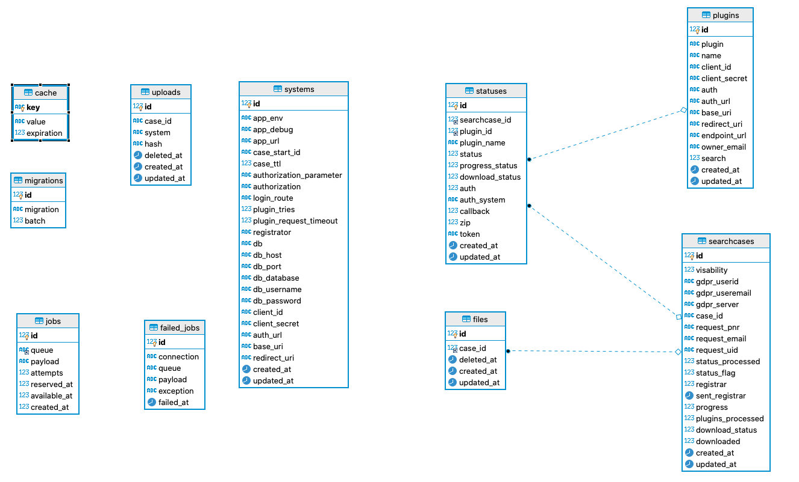
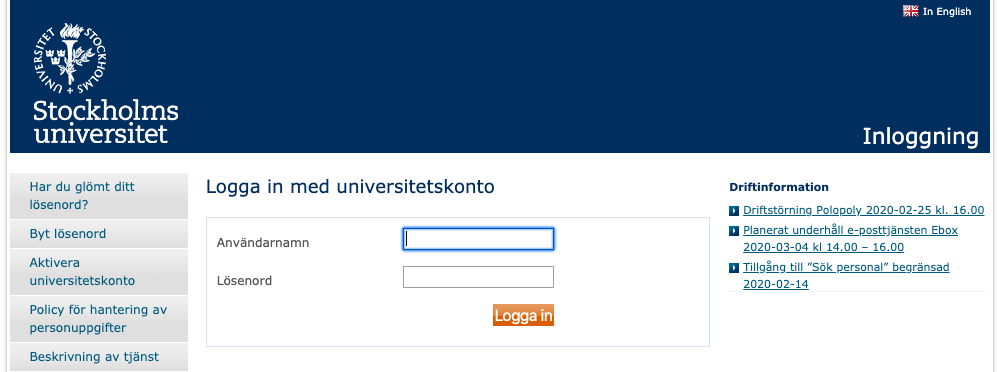
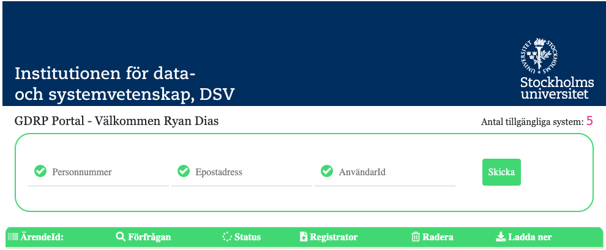
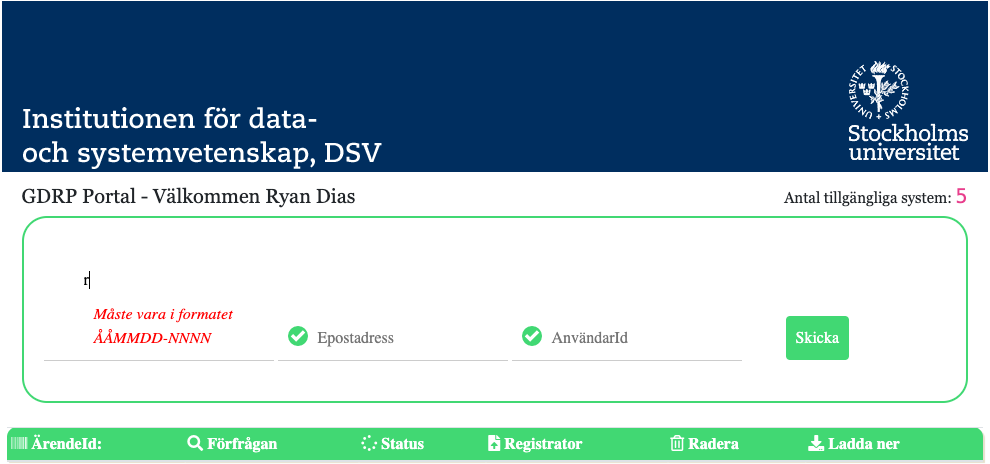
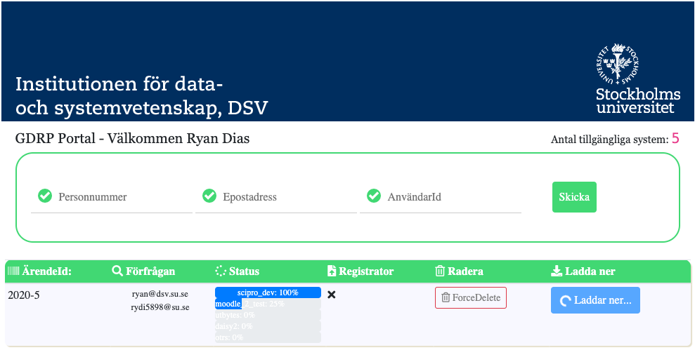
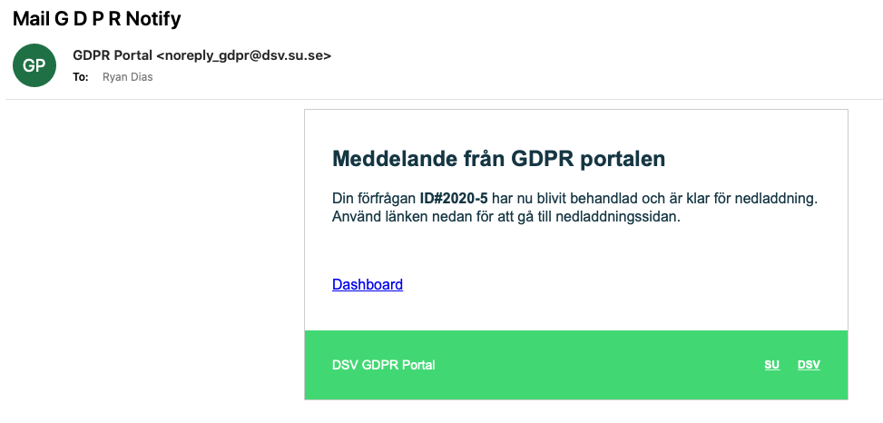

## GDPR Portal

1. Overview
2. Requirements
3. Installation
4. Workflow
5. Plugins
6. Database
7. User guide

## 1. Overview

The main objective of the GDPR portal is to intergrate existing systems GDPR dataextracts through a common tool.

## 2. Requirements
Requirements are best determined using Server Requirements page of corresponding Laravel 7 version
Currently used version is 7.10.3

PHP version 7.3.*

SSH access to the server

Composer

## 3. Installation (for deploying your own application)

* Make sure that composer is installed globally or install it in place

* Clone the repository

* Move into the directory. Move into the `/systemconfig` folder.

* Make sure that `/systemconfig/gdpr.ini` file is present and configured with the configuration details for your requirements and for the server (copy gdpr.ini.example to .ini and fill in with your data)

        [global]
        app_env=production                      ; Make sure this is set to production NOTE! For developing enviroment the settings should be set to: app_env=local and app_debug=true.
        app_debug=false                         ; Make sure this is set to false for production enviroments
        app_url=http://localhost                ; Set this to your domain
        case_ttl=30                             ; Time to live for a case - not yet implemented
        authorization_parameter=entitlement     ; The authorization parameter
        authorization=                          ; Authorization entitlements
        login_route=/login                      ; The SSO login route for your application (Server)
        plugin_tries=3                          ; Number of tries a plugin tries to contact a system before reporting error
        plugin_request_timeout=7200             ; Timeout before a plugin reports error
        registrator=registrator@dsv.su.se       ; Email address of registrar (change to your institution)
        
        [database]
        db=mysql                                ; Here you can specify which database you use: mysql, sqlite, pgsql, sqlsrv or redis 
        db_host=127.0.0.1                       ; DB host address
        db_port=3306                            ; DB port
        db_database=                            ; Database used     
        db_username=                            ; DB user
        db_password=                            ; secret
        
        [oauth]                                 ; Toker is the default access tokens system
        client_id =                             ; The id given to your system
        client_secret =                         ; Secret
        auth_url =                              ; The toker auth url
        base_uri =                              ; The toker base uri
        redirect_uri =                          ; The Toker redirect uri
        
* Once the global settings are entered you can install the dependencies. `composer install`

* Make sure that .env file is present (copy .env.example to .env). 

* Either create application key manually or do that with a command `php artisan key:generate`

* If you need to change the email configuration. Open the config/mail.php file and set the needed values within the from element

* Create the database with `php artisan migrate` (this should create database tables needed)

* Finally run `php artisan queue:work` OR any process monitor for your OS to start the processes for the pluginshandling.

## 4. Workflow

## 5. Plugins

The plugin handles connection to given systems to request GDPR extracts from various systems. The Portal comes with built-in plugins for the following systems: Scipro, Moodle, Drupal, Daisy and OTRS. The systems must be installed with a custom GDPR extension. In order to connect to another system, a new plugin must be implemented.

## Implementing a new plugin

### Plugin pattern/structure
The Plugin for each system consists basically of two files; A main file with a class that establishes a connection to a system and returns one or more files and a configurations file containing credential- and configuration information to the system. Plugins are handled by the PluginController.

### Plugin workflow
The Plugincontroller dispatches each plugin in order to a job process (que). Database tables is used to hold the jobs processes, failed processes (e.g. unable to connect to a system or server), progress and log information.
Through the Plugin a connection to external systems should be achieved and a zip file or more files containing requested gdpr data should be retrieved. 
Once the zip file has been retrieved from the external system it is stored and unpacked on the server disc identified by its case id. Once the entire queue has been processed and all files have been stored and unpacked the entire retrieved data will be packed and ready for downloading by the user. A mail will be sent to notify the user that the download is ready or if an error has occurred a mail will be sent to notify the user about the current status.

### Plugin configuration file
For each Plugin you need a plugin configuration file. All plugin-configuration files must be stored in the folder `/pluginconfig` and suffixed `.ini` for the system to recognise the file and accept it.

e.g.

`/pluginconfig/PluginName.ini` (configuration- and credentials file)

It is also good to create an example file with the same name but with a suffix .example that describes what attributes are needed for the given system.

`/pluginconfig/PluginName.example` (example-file)

The following configuration and credential attributes are allowed:

    [Name of the system]
    client_id =
    client_secret =
    auth_url =
    base_uri =
    redirect_uri =
    endpoint_url =
    owner_email =
    search =

If you have systems that use the same plugin you can stack them in the same configuration file.
e.g.

    [System1]
    client_id =
    client_secret =
    auth_url =
    base_uri =
    redirect_uri =
    endpoint_url =
    owner_email =
    search =
    
    [System2]
    client_id =
    client_secret =
    auth_url =
    base_uri =
    redirect_uri =
    endpoint_url =
    owner_email =
    search =
    
    
1.) Necessary attributes:

    [Name]
    search

The only two compulsory attributes for a plugin is the `Name` and `Search` attribute. This Name attribute should be the same as the filename for the Class, the Plugin-core file.    
    
The search attribute tells the portal which input queries are allowed. Consider the input form as a binary number with three binary digits. | social security number | email | user ID | if the system you are designing a plugin only can accept a single parameter you give the search attribute that value e.g. if the system only accepts a userId you assign search=1, if the system accepts both userid and email, search=3 etc.

    search=1 ; only userID
    search=2 ; only email
    search=3 ; email and uid
    search=4 ; only personnummer
    search=5 ; personnummer and uid
    search=6 ; personnr and email
    search=7 ; personummer, email and uid
    
    
2.) Alternative attributes:

If a alternative token access system is used this attribute should be set to "other". The default authenification system used is toker.

    auth = 
    
For systems that have not yet fully implemented a working source "plugin", there is the option to email the system owner. In this case, the owner_email attribute should be set to the email-address of the system responsible owner. 

    owner_email =

The GDPR portal will send an email to the system owner requesting a file upload (the email is secured with a hash). The status of the plugin will be set to Completed once the system owner has uploaded a file( the requested extract). The uploaded extract will be stored and bundled with the other extracts.
### Plugin core file

The plugin core file should establish a connection to the provider-system and return one or more files.

PluginName.php (core) should be named after the systems it connects to.

    Important! The class must have the same name as the filename for the plugin-autoloader to recognize it.

GenricPlugin

The abstract class GenricPlugin establishes a base of interfaces and abstract classes that allow easily integration with the Portal and should be used

    class MyPlugin extends GenericPlugin

The GenricPlugin class injects the following  instances to your subclass via the constructor:
    
    Case $case, Plugin $plugin, Status $status
    
The `Case $case` instance holds the latest generated case.

The `Plugin $plugin` instance holds the called plugin.

The `Status $status` instance holds the plugin-case-status.

#### Plugin Authorization

The GenricPlugin has a built in method to the Toker, issueing signed tokens, allowing the system to access resources that are permitted with that token.
If you need to use a different system, you need to create a method, auth() for this in your subclass and add the auth = other attribute in your configuration file.
If you dont use a signed token system you can pass an array of HTTP authentication parameters to use with the request.

### Installed Packages
The following client libraries are installed and can be used with your Plugin. If you need other libraries you can add them via composer.

Guzzle 6: 	
        
    use GuzzleHttp\Client;
	use GuzzleHttp\HandlerStack;
		
Kamermans:	

    use kamermans\OAuth2\GrantType\ClientCredentials;
    use kamermans\OAuth2\OAuth2Middleware;

### Passing arguments/objects
The Plugin should receive information from the PluginController by passing arguments (a search array and the plugin-object) to the constructor and should return a zip-file to be processed. The configuration file for the plugin should contain necessary data for connecting to the server e.g. client_id, client_secret, authorization code, callback uri, auth url, endpoint url.

### Response Status Codes

The Plugin should return a status code if the resource is not returned and report a status.  The message codes below have been designed for this purpose:

Message code | corresponds to HTTP Status code |  Description
------------ | ------------- | --------------
ok | (200) | The request has succeeded. The client can read the result of the request in the body and the headers of the response.
not_found | (204) | User not Found - The requested user could not be found.
error | (400) | Bad Request - The request could not be understood by the server due to malformed syntax.
error | (401) | Unauthorized - The request requires user authentication or, if the request included authorization credentials, authorization has been refused for those credentials.
error | (404) | Provider Server Error. Offline.
mismatch | (409) | The user data given exist in dublicate. Mismatch data given.
error | (500) | Internal Server Error
pending | (300) | Waiting for manual upload of data.

## 6. Database

### 6.1 Status flags

####  for each case

status_flag

value | state
------|------
0 | System error; One or more systems reported a 400 or 404
1 | Initial status
2 | User not found
3 | Request successful

registrar

value | state
------|------
0 | Downloaded zip has Not been sent to registrar
1 | Downloaded zip has been sent to registrera at date (see sent_registrar)

sent_registrar

value | state
------|------
date | date when zip file was sent to registrar

progress

value | state
------|------
0 | Progress of request has been completed
1 | Request is under progress

plugins_processed

plugins_processed | .
------------------|------
number of plugins that have been processed |

download_status | .
----------------|-----
total download in % | 

downloaded | .
-----------|-------
value | state 
0 | No
1| Yes

#### statuses
searchcase_id | plugin_id | plugin_name | status | progress_status | download_status | auth | auth_system | callback | zip | token |
--------------|-----------|-------------|--------|-----------------|-----------------|------|-------------|----------|-----|-------|

#### plugin
plugin | name | client_id | client_secret | auth | auth_url | base_uri | redirect_uri | endpoint_url | owner_email | search |
-------|------|-----------|---------------|------|----------|----------|--------------|--------------|-------------|--------|

## 7. User guide
The development version of the portal can be found under the following url:

https://methone.dsv.su.se

For access to the page, you must first be authenticated by SU IdP, needing the necessary entitlements. You will be redirected automatically for authentication. The trial version does not require the user to have the entitlement gdpr yet but this will be added to the production version.

When logged in, you can access the dashboard.

In the Dashboard there is a form and a table to show the status of cases. Searching for GDPR extracts are done by entering information into the form. Input is made with a swedish personal identity number (Personnummer) or a co-ordination number in the format YYMMDD-NNNN, and/or valid e-mail address and/or SU User ID. The more information that is entered, the greater the hit can be expected in the systems searched. Validation of the form (according to defined rules) is active to help the user to make as little errors as possible with entry.

A search is started by submitting the form and a case is generated. This is shown in the dashboard. The status of each system being searched is also displayed.

When the search is completed, the user receives an email and can log in to the dashboard again. Some searches may take time and the system works in the background.

When the search is completed, the table shows the status of each system (and cases if more have been processed) that have been searched and the user has the opportunity to download a single file containing files from all searched systems for each individual case. The file can also be sent directly to the registrar for registration.

If a user is not registered in a system, this is displayed in the status and the status indication shows the color yellow, user not found.

A system error is indicated in red and then the entire request must be performed again later after the issue has been resolved.

After the request is completed and downloaded, cases can be removed manually.
