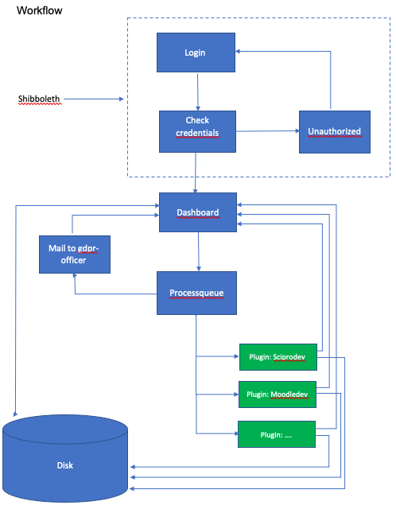
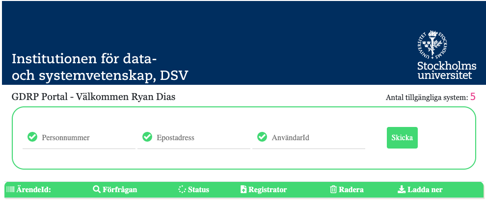
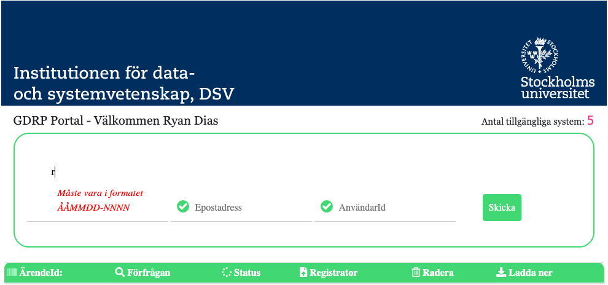

#GDPR Portal

The GDPR portal is a web application that connects to existing systems and requests GDPR data.

## Workflow

## Plugins
### Plugin pattern/structure
The plugin (a kind of controller) handles connection to given systems to request GDPR extracts from various systems. The Plugin for each system consists of three files; A main file, a process file to dispatch the plugin to a que and a configurations file containing credential- and configuration information if needed. This structure will be reworked in the future to allow easier integration. All plugins are handled by the PluginController.
e.g.

(1) SciproPlugin.php (core-file)

(2) ProcessScipro.php (job handler)

(3) Services.php (configuration and credentials)

### Plugin workflow
The Plugincontroller dispatches each plugin in order to a job process explicitly defining which queue it should be dispatched to, passing retrieved information entered by the user. A database table is used to hold the jobs processes and also failed processes (e.g. unable to connect to a system or server).
Through the Plugin a connection to external systems should be achieved and a zip file containing gdpr data should be retrieved. In able to access this file, the plugin in most cases must be authorized by the system to access that particular information (client id and a client secret has to be issued if required by the system). 
Once the zip file has been retrieved from the external system it is stored and unpacked on the server disc identified by its case id. Once the entire queue has been processed and all files have been stored and unpacked the entire retrieved data will be packed and ready for downloading by the user. A mail will be sent to notify the user that the download is ready or if an error has occurred a mail will be sent to notify the user about the current status.

## Implementing a new plugin
//TODO

### Installed Packages
The following client libraries are installed.

Guzzle 6: 	
        
    use GuzzleHttp\Client;
	use GuzzleHttp\HandlerStack;
		
Kamermans:	

    use kamermans\OAuth2\GrantType\ClientCredentials;
    use kamermans\OAuth2\OAuth2Middleware;

### Passing arguments
The Plugin should receive information from the PluginController by passing arguments to the constructor and should return a zip-file to be processed. The configuration file for the plugin should contain necessary data for connecting to the server e.g. client_id, client_secret, authorization code, callback uri, auth url, endpoint url.

### Response Status Codes

Status code | Description
------------ | -------------
200 | OK - The request has succeeded. The client can read the result of the request in the body and the headers of the response.
202| Accepted - The request has been accepted for processing, but the processing has not been completed.
204 | User not Found - The requested user could not be found.
400 | Bad Request - The request could not be understood by the server due to malformed syntax.
401 | Unauthorized - The request requires user authentication or, if the request included authorization credentials, authorization has been refused for those credentials.
500 | Internal Server Error.

## User guide
The trialversion of the portal can be found under the following url:

https://methone.dsv.su.se

For access to the page, you must first be authenticated by SU IdP. You will be redirected automatically for authentication. The trial version does not require the user to have the entitlement gdpr but this will be added to the production version. When logged in, you can access the dashboard.

In the Dashboard there is a form and a table to show the status of cases. Searching for GDPR extracts are done by entering information into the form. Input is made with person number in the format YYMMDD-NNNN, e-mail address and User ID. The more information that is entered, the greater the hit can be expected in the systems searched. Validation of the form (according to defined rules) is active to help the user to make as little errors as possible with entry. In the current trial version, search is only possible with user ID.

A search is started by submitting the form and a case is generated. This is shown in the dashboard. The status of each system being searched is also displayed.

When the search is completed, the user receives an email and can log in to the dashboard again. Some searches may take time and the system works in the background.

When the search is completed, the table shows the status of each system (and cases if more have been processed) that have been searched and the user has the opportunity to download a single file containing files from all searched systems for each individual case. The file can also be sent directly to the registrar for registration (// Todo).

If a user is not registered in a system, this is displayed in the status and the status indication shows the color yellow, user not found.

A system error is indicated in red and then the entire request must be performed again later after the issue has been resolved.

After the request is completed and downloaded, cases can be removed manually. After 30 days the case and all files concerning the case is automatically deleted by the system. (//TODO)
